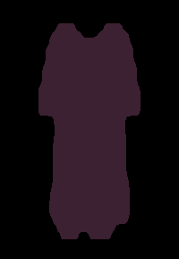
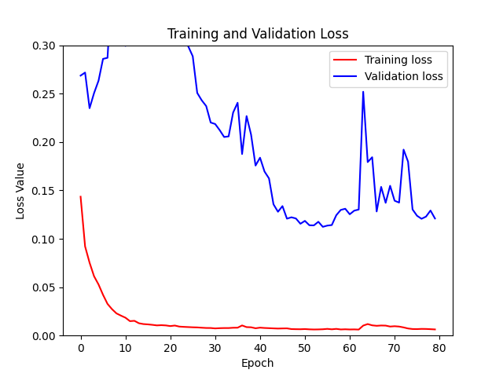
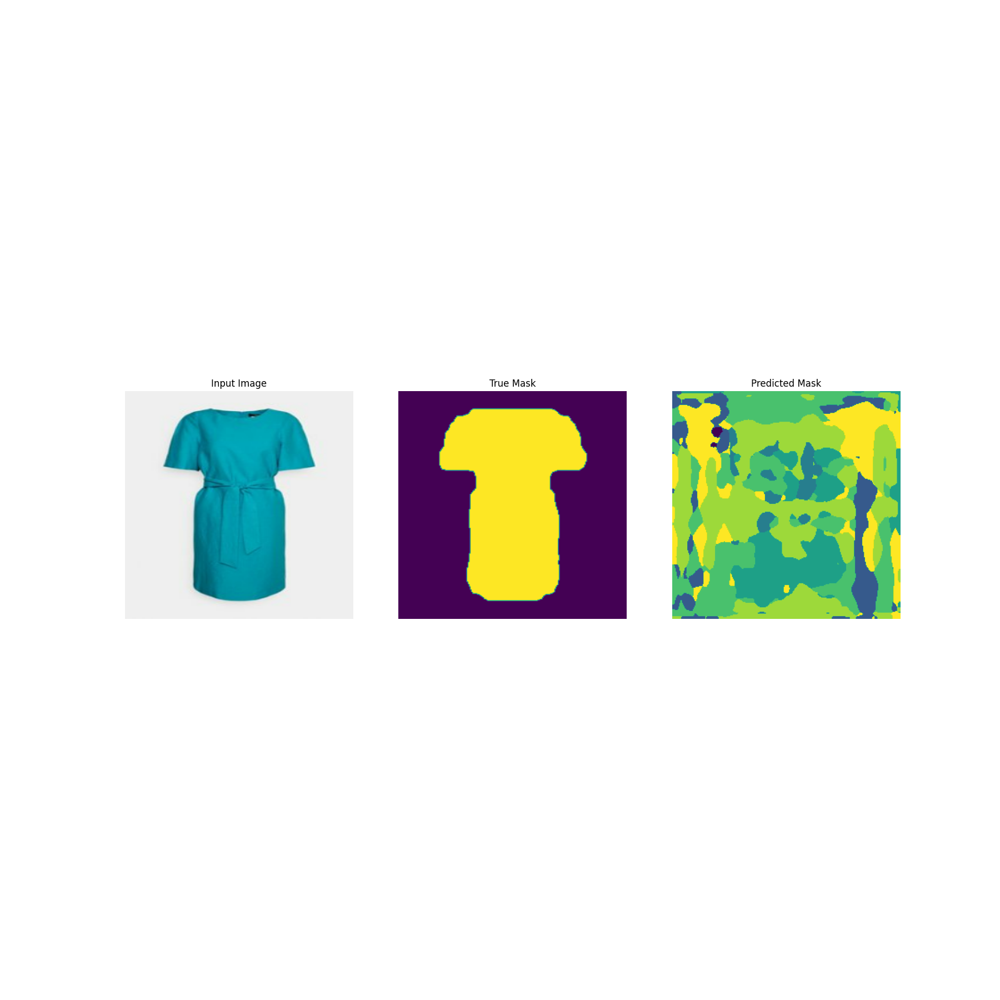

# Predicting Style with Computer Vision #

As a supplement to the clothing classifier, a computer vision algorithm is constructed to analyze the size, shape and color of each garmet in the dataset to better interpret style. Instance segmentation is used for the pixel-wise classification for this project. This ensures the exact geometry and dimensions of a given garmet are captured and those features are used to provide better discrimination and classification of our 'style' feature.

## Algorithm, Machine Learning Framework and Data Selection ##

We use a series of 971 images split into a training (80%) validation (10%) and test set (10%) in order to both train our classifier and validate its performance. The images themselves are scraped from the ecommerce website. Ground truth pixel masks are generated manually for all 971 images in the dataset, where 97 of those are used as a hold-out set to prove the accuracy of the model.

A deep neural network system, specifically a convultional neural network (CNN) is used for building the feature maps and computing the weights and biases used to infer our pixel-wise classification and eventual categorization of the images:

Example of a scrapped image for instance segmentation routine:


Example of a manually annotated mask for instance segmentation routine:




Each pixel in the mask corresponds to a specific category which uses a flattened palletized png where the given pallet assignment for a pixel corresponds to a specific class (for example, a green pixel corresponds to 'casual chic', where a red one corresponds to 'classic' etc).

Once all garmets have annotated pixel masks generated, we introduce both into a TensorFlow Keras model to convolve and learn the weights and biases that define each style class based on each garmets optical features. The DeepLabV3+ algorithm is chosen for its feature discrimination capabilities and performance enhancements from legacy segmentation frameworks:


DeepLabv3+ extends DeepLabv3 by adding an encoder-decoder structure. The encoder module processes multiscale contextual information by applying dilated convolution at multiple scales, while the decoder module refines the segmentation results along object boundaries.

We've also chosen to use the ResNet50 pretrained model to allow for better pixel discrimination for our newly introduced style class. 

The hyper-parameters used to train the model are iterated on to discover the optimal settings. In this case, we use a learning rate of 0.0001 with the Adam optimization function and sparse categorical crossentropy as the loss function.

## Code Explaination ##

The training code for building the model can be found in the train_model.py file. The algorithm leverages the TensorFlow machine learning framework to simplify the implmentation and speed up training time. We also use GPU accelerated training to reduce the compute time normally required for learning parameters.

First, we import various libraries needed for importing our images (and associated masks), machine learning frameworks (including tensorflow) and other image processing algorithms including openCV and PIL required to preprocess and convert our images into palletized representations:


```python
from glob import glob

import IPython.display as display
import matplotlib.pyplot as plt
import numpy as np
import tensorflow as tf
import datetime, os
from tensorflow.keras.layers import *
from tensorflow.keras.callbacks import EarlyStopping, ModelCheckpoint
from tensorflow.keras.optimizers import Adam

from tensorflow import keras
from tensorflow.keras import layers


from IPython.display import clear_output
from PIL import Image
from PIL import ImagePalette
from keras.backend import manual_variable_initialization 
import cv2

```

Next, we apply autotuning to improve the performance of our data pipeline and set our randomize seed (arbitrarily selected) and the learning rate.


```python
# For more information about autotune:
# https://www.tensorflow.org/guide/data_performance#prefetching
AUTOTUNE = tf.data.experimental.AUTOTUNE
print(f"Tensorflow ver. {tf.__version__}")

# important for reproducibility
# this allows to generate the same random numbers
SEED = 42
LEARNING_RATE = 0.0001
```

We then specify the directories where our training and validation sets are located (in this case we use an 80/20 split of our ground truth images and associated masks). We also clear our prediction and working directory folders for the new training job. We also specify that the GPU socket (if available) will be used for training:


```python
# you can change this path to reflect your own settings if necessary
training_data = "training/images/"
training_annotations = "training/annotations/"
val_data = "validation/images/"
val_an = "validation/annotations/"

#Clear the training image directories
progression_graphs = glob('prediction_progression/*')
for f in progression_graphs:
    os.remove(f)

predictions = glob('predictions/*')
for f in predictions:
    os.remove(f)

frames_overlayed = glob('frames_overlayed/*')
for f in frames_overlayed:
    os.remove(f)

frames_masks = glob('frames_masks/*')
for f in frames_masks:
    os.remove(f)

gpus = tf.config.experimental.list_physical_devices('GPU')
if gpus:
    try:
        for gpu in gpus:
            tf.config.experimental.set_memory_growth(gpu, True)
        logical_gpus = tf.config.experimental.list_logical_devices('GPU')
        print(len(gpus), "Physical GPUs,", len(logical_gpus), "Logical GPUs")
    except RuntimeError as e:
        print(e)

```

Next, we specify the image input size (256x256 in this case) number of channels (3 for RGB) and the kernel size (filter size for the size of the block that we will be convolving over):


```python
# Image size that we are going to use
IMG_SIZE = 256
# Our images are RGB (3 channels)
N_CHANNELS = 3
# Scene Parsing has 150 classes + `not labeled`
N_CLASSES = 8
# Neural Network Kernel size
KERNEL_SIZE = 3

TRAINSET_SIZE = len(glob(training_data + "*.jpg"))
print(f"The Training Dataset contains {TRAINSET_SIZE} images.")

VALSET_SIZE = len(glob(val_data + "*.jpg"))
print(f"The Validation Dataset contains {VALSET_SIZE} images.")
```

We create a callback class that will execute during training after each iteration or epoch is complete. This is required to capture in-flight training metrics we use to track the performance of our training job:

```python
class DisplayCallback(tf.keras.callbacks.Callback):
    def on_epoch_end(self, epoch, logs=None):
        clear_output(wait=True)
        show_predictions(epoch)
        print ('\nSample Prediction after epoch {}\n'.format(epoch+1))

```

An image parsing function is used to convert images into their uint8 format needed for pixel-wise classification:

```python
def parse_image(img_path: str) -> dict:
   
    image = tf.io.read_file(img_path)
    image = tf.image.decode_jpeg(image, channels=3)
    image = tf.image.convert_image_dtype(image, tf.uint8)

   
    mask_path = tf.strings.regex_replace(img_path, "images", "annotations")
    mask_path = tf.strings.regex_replace(mask_path, "jpg", "png")

    mask = tf.io.read_file(mask_path)
   
    mask = tf.image.decode_png(mask, channels=1)
    
    mask = tf.where(mask == 255, np.dtype('uint8').type(0), mask)
  

    return {'image': image, 'segmentation_mask': mask}
```

An upscaling routine is also created to resize images back to their original size after inference:


```python
def upscale_prediction(orig_path, prediction):
    
    image_orig = tf.io.read_file(orig_path)
    image_orig = tf.image.decode_jpeg(image_orig, channels=3)

    h = image_orig.shape[0]
    w = image_orig.shape[1]

    new_mask = tf.image.resize(prediction, (h, w))

    return new_mask
```

The training set and validation set are then constructed using tensorflow image maps. This allows for a relationship to be easily mapped between a specific training or validation image and its partnering mask.

```python
train_dataset = tf.data.Dataset.list_files(training_data + "*.jpg", seed=SEED)
train_dataset = train_dataset.map(parse_image)

val_dataset = tf.data.Dataset.list_files(val_data + "*.jpg", seed=SEED)
val_dataset =val_dataset.map(parse_image)
```

Various normalization and loading functions are used to further process the images. We use tensorflow processes to resize and convert image pixels into their respective scaler representations for the network to interpret during training:

```python
@tf.function
def normalize(input_image: tf.Tensor, input_mask: tf.Tensor) -> tuple:
    
    input_image = tf.cast(input_image, tf.float32) / 255.0
    return input_image, input_mask

@tf.function
def load_image_train(datapoint: dict) -> tuple:
   
    input_image = tf.image.resize(datapoint['image'], (IMG_SIZE, IMG_SIZE))
    input_mask = tf.image.resize(datapoint['segmentation_mask'], (IMG_SIZE, IMG_SIZE))

    if tf.random.uniform(()) > 0.5:
        input_image = tf.image.flip_left_right(input_image)
        input_mask = tf.image.flip_left_right(input_mask)
    input_image, input_mask = normalize(input_image, input_mask)

    return input_image, input_mask

@tf.function
def load_image_test(datapoint: dict) -> tuple:
  
    input_image = tf.image.resize(datapoint['image'], (IMG_SIZE, IMG_SIZE))
    input_mask = tf.image.resize(datapoint['segmentation_mask'], (IMG_SIZE, IMG_SIZE))

    input_image, input_mask = normalize(input_image, input_mask)

    return input_image, input_mask

```

The training batch size and max buffer size is also set while the training and validation sets are constructed and shuffled randomly (using our randomly selected seed)"

```python
BATCH_SIZE = 32

BUFFER_SIZE = 1000

dataset = {"train": train_dataset, "val": val_dataset}

# -- Train Dataset --#
dataset['train'] = dataset['train'].map(load_image_train, num_parallel_calls=tf.data.experimental.AUTOTUNE)
dataset['train'] = dataset['train'].shuffle(buffer_size=BUFFER_SIZE, seed=SEED)
dataset['train'] = dataset['train'].repeat()
dataset['train'] = dataset['train'].batch(BATCH_SIZE)
dataset['train'] = dataset['train'].prefetch(buffer_size=AUTOTUNE)

#-- Validation Dataset --#
dataset['val'] = dataset['val'].map(load_image_test)
dataset['val'] = dataset['val'].repeat()
dataset['val'] = dataset['val'].batch(BATCH_SIZE)
dataset['val'] = dataset['val'].prefetch(buffer_size=AUTOTUNE)

print(dataset['train'])
print(dataset['val'])

```

A display function is created to show the predictions during training. This is useful for interpreting the output of the model after each training iteration (epoch):

```python
def display_sample(epoch, display_list):
   
    plt.clf()
    plt.figure(figsize=(18, 18))
   
    title = ['Input Image', 'True Mask', 'Predicted Mask']

    for i in range(len(display_list)):
        plt.subplot(1, len(display_list), i+1)
        plt.title(title[i])
        plt.imshow(tf.keras.preprocessing.image.array_to_img(display_list[i]))
        plt.axis('off')
    
    plt.savefig('prediction_progression/' + str(epoch) + '_sample_prediction.png')
    plt.close()

input_size = (IMG_SIZE, IMG_SIZE, N_CHANNELS)
initializer = 'he_normal'
```

We also define a function which can be used to create each convolutional block that we'll assign to our UNET. We'll use for the algorithm (as described previously):

```python
def convolution_block(
    block_input,
    num_filters=256,
    kernel_size=3,
    dilation_rate=1,
    padding="same",
    use_bias=False,
    ):
    x = layers.Conv2D(
        num_filters,
        kernel_size=kernel_size,
        dilation_rate=dilation_rate,
        padding="same",
        use_bias=use_bias,
        kernel_initializer=keras.initializers.HeNormal(),
    )(block_input)
    x = layers.BatchNormalization()(x)
    return tf.nn.relu(x)
```

We use dialated spatial pyramid pooling for dynmically changing the pixel padding:

```python
def DilatedSpatialPyramidPooling(dspp_input):
    dims = dspp_input.shape
    x = layers.AveragePooling2D(pool_size=(dims[-3], dims[-2]))(dspp_input)
    x = convolution_block(x, kernel_size=1, use_bias=True)
    out_pool = layers.UpSampling2D(
        size=(dims[-3] // x.shape[1], dims[-2] // x.shape[2]), interpolation="bilinear",
    )(x)

    out_1 = convolution_block(dspp_input, kernel_size=1, dilation_rate=1)
    out_6 = convolution_block(dspp_input, kernel_size=3, dilation_rate=6)
    out_12 = convolution_block(dspp_input, kernel_size=3, dilation_rate=12)
    out_18 = convolution_block(dspp_input, kernel_size=3, dilation_rate=18)

    x = layers.Concatenate(axis=-1)([out_pool, out_1, out_6, out_12, out_18])
    output = convolution_block(x, kernel_size=1)
    return output
```

The structure and shape of our UNET model is then defined. Note the reset50 pretrained model is used and each convultional block is dynamically created. The encoder features are first bilinearly upsampled by a factor 4, and then concatenated with the corresponding low-level features from the network backbone that have the same spatial resolution. For this example, we use a ResNet50 pretrained on ImageNet as the backbone model, and we use the low-level features from the conv4_block6_2_relu block of the backbone:

```python
def DeeplabV3Plus(image_size, num_classes):
    model_input = keras.Input(shape=(image_size, image_size, 3))
    resnet50 = keras.applications.ResNet50(
        weights="imagenet", include_top=False, input_tensor=model_input
    )
    x = resnet50.get_layer("conv4_block6_2_relu").output
    x = DilatedSpatialPyramidPooling(x)

    input_a = layers.UpSampling2D(
        size=(image_size // 4 // x.shape[1], image_size // 4 // x.shape[2]),
        interpolation="bilinear",
    )(x)
    input_b = resnet50.get_layer("conv2_block3_2_relu").output
    input_b = convolution_block(input_b, num_filters=48, kernel_size=1)

    x = layers.Concatenate(axis=-1)([input_a, input_b])
    x = convolution_block(x)
    x = convolution_block(x)
    x = layers.UpSampling2D(
        size=(image_size // x.shape[1], image_size // x.shape[2]),
        interpolation="bilinear",
    )(x)
    model_output = layers.Conv2D(num_classes, kernel_size=(1, 1), padding="same")(x)
    return keras.Model(inputs=model_input, outputs=model_output)
```

We also add a few helper functions to visualize and overlay our predictions during training to get a better understanding of model performance while training:

```python
# We use an even class distribution for this problem
def add_sample_weights(image, label):

  class_weights = tf.constant([0.06, 0.13, 0.13, 0.13, 0.13, 0.13, 0.13, 0.13])
  class_weights = class_weights/tf.reduce_sum(class_weights)

  sample_weights = tf.gather(class_weights, indices=tf.cast(label, tf.int32))

  return image, label, sample_weights

def create_mask(pred_mask: tf.Tensor) -> tf.Tensor:
    
    pred_mask = tf.argmax(pred_mask, axis=-1)
    
    pred_mask = tf.expand_dims(pred_mask, axis=-1)
    return pred_mask
    
def show_predictions(epoch, num=1):
    
    for image, mask in dataset['train'].take(1):
        sample_image, sample_mask = image, mask

    image = sample_image[0][tf.newaxis, ...]
    
    #test_image_url = 'test_image.jpg'
    #test_image = parse_image2(test_image_url)

    inference = model.predict(image)
    pred_mask = create_mask(inference)
    
    np.savetxt("prediction_mask_train.csv", tf.squeeze(pred_mask), delimiter=",")
    tf.keras.preprocessing.image.save_img("predictions/prediction_" + str(epoch) + ".png", tf.squeeze(pred_mask, [0]), data_format=None, file_format=None, scale=True)
    display_sample(epoch, [sample_image[0], sample_mask[0], pred_mask[0]])

def overlay_transparent(bg_img, img_to_overlay_t):
   
    bg_img = cv2.cvtColor(bg_img, cv2.COLOR_RGB2RGBA)

    added_image = cv2.addWeighted(bg_img,1,img_to_overlay_t,0.4,0)

    return added_image

def make_transparent(file_name):

    src = cv2.imread(file_name, 1)
    
    
    src[src != 255] = 0

   
    tmp = cv2.cvtColor(src, cv2.COLOR_BGR2GRAY)
    _,alpha = cv2.threshold(tmp,0,60,cv2.THRESH_BINARY)
    b, g, r = cv2.split(src)

    rgba = [b,g,r, alpha]
    dst = cv2.merge(rgba)

    return dst

def convert2RGB(prediction):

    prediction = tf.argmax(prediction, axis=-1)
    prediction = tf.expand_dims(prediction, axis=-1)

    prediction = tf.squeeze(prediction, [0])

    prediction = np.where(prediction == 0, [0, 0, 0], prediction)
    prediction = np.where(prediction == 1, [245, 245, 66], prediction)
    

    prediction = np.where(prediction == 2, [66, 135, 245], prediction)
    prediction = np.where(prediction == 3, [66, 135, 245], prediction)
    prediction = np.where(prediction == 4, [66, 135, 245], prediction)

   
    return prediction
```

Finally, we define the number of epochs, logging directory and start our training job using the hyper-parameters specified above. A checkpoint model is saved when the model performance is improved and training performance is historized using the loss metric and charted for interpretation:


```python

EPOCHS = 80
STEPS_PER_EPOCH = TRAINSET_SIZE // BATCH_SIZE
VALIDATION_STEPS = VALSET_SIZE // BATCH_SIZE

logdir = os.path.join("logs", datetime.datetime.now().strftime("%Y%m%d-%H%M%S"))
tensorboard_callback = tf.keras.callbacks.TensorBoard(logdir, histogram_freq=1)

callbacks = [
    # to show samples after each epoch
    DisplayCallback(),
    # to save checkpoints
    tf.keras.callbacks.ModelCheckpoint('model_unet_check.h5', verbose=1, save_best_only=True, save_weights_only=True)
    
]

#model = tf.keras.Model(inputs = inputs, outputs = output)
model = DeeplabV3Plus(image_size=IMG_SIZE, num_classes=N_CLASSES)
print(model.summary())

# Functional
optimizer = Adam(learning_rate=LEARNING_RATE)
loss = tf.keras.losses.SparseCategoricalCrossentropy(from_logits=True)

model.compile(optimizer=optimizer, loss = loss,
                  metrics=['accuracy'])


model_history = model.fit(dataset['train'].map(add_sample_weights), 
                          epochs=EPOCHS,
                          steps_per_epoch=STEPS_PER_EPOCH,
                          validation_steps=VALIDATION_STEPS,
                          validation_data=dataset['val'].map(add_sample_weights),
                          callbacks=[callbacks])


    
model.save('final_' + str(EPOCHS) + '.h5')

loss = model_history.history['loss']
val_loss = model_history.history['val_loss']

epochs = range(EPOCHS)
plt.clf()
plt.figure()
plt.plot(epochs, loss, 'r', label='Training loss')
plt.plot(epochs, val_loss, 'b', label='Validation loss')
plt.title('Training and Validation Loss')
plt.xlabel('Epoch')
plt.ylabel('Loss Value')
plt.ylim([0, 0.3])
plt.legend()
plt.savefig('TrainingLoss.png')

```

The final output of our training is captured in the training loss chart. This helps us determine if the model is overfit or if the model needs further (longer) training time in order to converge. In this case, we see that the initial training predictions about style are erradict but eventually normalize and follow an optimal training curve to produce a model that generalizes reasonably well:





Progress can be monitored during training using the saved images in the prediction_progress folder:


Example of a prediction after a single epoch (poor quality, a lot of confusion):





Example of a prediction after 80 epochs (near perfect pixel-wise prediction):


Once training completes, the saved model can be used for making predictions using new inputs about what style category they belong to.


## Predicting Style Class with a Trained CNN ##

Once the model has been trainined, as described in the previous section, it then becomes possible to load the saved model and make predictions about new, previously unseen input images.

The predict_batch.py file contains the scripts needed to make predictions about our unlabeled (does not contain the style class) images.

As with our training script, we first load the libraries need to load the model and process images:

```python
from glob import glob

import IPython.display as display
import matplotlib.pyplot as plt
import numpy as np
import tensorflow as tf
import datetime, os
from tensorflow.keras.layers import *
from tensorflow.keras.callbacks import EarlyStopping, ModelCheckpoint
from tensorflow.keras.optimizers import Adam

from tensorflow import keras
from tensorflow.keras import layers

from IPython.display import clear_output
from keras_radam import RAdam
from PIL import Image
from PIL import ImagePalette
```

As with training, our various hyper-parameters are specified including image size, number of classes (styles) and kernel block size:

```python
# Image size that we are going to use
IMG_SIZE = 256
# Our images are RGB (3 channels)
N_CHANNELS = 3
# Scene has 5 classes
N_CLASSES = 8
# Neural Network Kernel size
KERNEL_SIZE = 3

input_size = (IMG_SIZE, IMG_SIZE, N_CHANNELS)
```

The same functions are also defined for defining the structure of the UNET and pre and post processing the images:

```python
def convolution_block(
    block_input,
    num_filters=256,
    kernel_size=3,
    dilation_rate=1,
    padding="same",
    use_bias=False,
    ):

    x = layers.Conv2D(
        num_filters,
        kernel_size=kernel_size,
        dilation_rate=dilation_rate,
        padding="same",
        use_bias=use_bias,
        kernel_initializer=keras.initializers.HeNormal(),
    )(block_input)
    x = layers.BatchNormalization()(x)
    return tf.nn.relu(x)

def DilatedSpatialPyramidPooling(dspp_input):
    dims = dspp_input.shape
    x = layers.AveragePooling2D(pool_size=(dims[-3], dims[-2]))(dspp_input)
    x = convolution_block(x, kernel_size=1, use_bias=True)
    out_pool = layers.UpSampling2D(
        size=(dims[-3] // x.shape[1], dims[-2] // x.shape[2]), interpolation="bilinear",
    )(x)

    out_1 = convolution_block(dspp_input, kernel_size=1, dilation_rate=1)
    out_6 = convolution_block(dspp_input, kernel_size=3, dilation_rate=6)
    out_12 = convolution_block(dspp_input, kernel_size=3, dilation_rate=12)
    out_18 = convolution_block(dspp_input, kernel_size=3, dilation_rate=18)

    x = layers.Concatenate(axis=-1)([out_pool, out_1, out_6, out_12, out_18])
    output = convolution_block(x, kernel_size=1)
    return output

def DeeplabV3Plus(image_size, num_classes):
    model_input = keras.Input(shape=(image_size, image_size, 3))
    resnet50 = keras.applications.ResNet50(
        weights="imagenet", include_top=False, input_tensor=model_input
    )
    x = resnet50.get_layer("conv4_block6_2_relu").output
    x = DilatedSpatialPyramidPooling(x)

    input_a = layers.UpSampling2D(
        size=(image_size // 4 // x.shape[1], image_size // 4 // x.shape[2]),
        interpolation="bilinear",
    )(x)
    input_b = resnet50.get_layer("conv2_block3_2_relu").output
    input_b = convolution_block(input_b, num_filters=48, kernel_size=1)

    x = layers.Concatenate(axis=-1)([input_a, input_b])
    x = convolution_block(x)
    x = convolution_block(x)
    x = layers.UpSampling2D(
        size=(image_size // x.shape[1], image_size // x.shape[2]),
        interpolation="bilinear",
    )(x)
    model_output = layers.Conv2D(num_classes, kernel_size=(1, 1), padding="same")(x)
    return keras.Model(inputs=model_input, outputs=model_output)

def parse_image(img_path):
    
    image_new = tf.io.read_file(img_path)
    image_new = tf.image.decode_jpeg(image_new, channels=3)
    image_new = tf.image.resize(image_new, (256, 256))
    image_new = tf.cast(image_new, tf.float32) / 255.0
    
    image_new = image_new[tf.newaxis, ...]
    
    return image_new

def create_mask(pred_mask: tf.Tensor) -> tf.Tensor:
   
    pred_mask = tf.argmax(pred_mask, axis=-1)
    pred_mask = tf.expand_dims(pred_mask, axis=-1)
    return pred_mask

def get_class_prediction(inference: tf.Tensor):

    classes = ['unknown', 'classic', 'sporty', 'girly', 'edgy', 'casual chic', 'trendy', 'alternative']
    class_map = dict(map(lambda t: (t[1], t[0]), enumerate(classes)))

    predicted_class = 0
    array_size = 0
    
    # Let's find the probable class
    for i in range(8):
        if i > 0:
            mask_index = inference[:, :, :, i]
            mask_size = tf.math.reduce_sum(mask_index)
            #tf.print(mask_size)
            if mask_size > array_size:
                array_size = mask_size
                predicted_class = i 

    if array_size < 5000:
        predicted_class = 0
    
    prediction = list(class_map.keys())[list(class_map.values()).index(predicted_class)]
    return prediction


```

A scraping function is created to download the images for all our unlabeled examples where style is unknown:


```python
def scrape_image(index, dress_page):
    #dress_page = dress_page.replace(" ","")

    parsed_image = []

    page = None
    print(dress_page)
    dress_page = dress_page.replace(" ","")

    try:
        page = urllib2.urlopen(dress_page)
        
    except urllib2.HTTPError as e:
        print(str(index) + ' could not find: ' + dress_page + '. Failed with error code: ' + str(e.code))
    
    # Parse the page if returned data
    if page is not None:

        soup = BeautifulSoup(page, 'html.parser')

        images = []
        for img in soup.findAll('img', attrs={'class': 'FxZV-M'}):
            if "packshot" not in img.get('src'): 
                continue
            else:
                images.append(img.get('src'))
                break

        if len(images) > 0:
            urllib2.urlretrieve(images[0], "scraped_labeled/" + str(index) + ".jpg")
            parsed_image = parse_image("scraped_labeled/" + str(index) + ".jpg")
    
    return parsed_image
```


Finally, we load the previously saved model and make predictions from the captured images. The algorithm counts the number of pixels assigned to each class, and selects the dominant class as the predicted style:


```python

#Load our model
model = DeeplabV3Plus(image_size=IMG_SIZE, num_classes=N_CLASSES)
model.load_weights('final_80.h5')
weights = model.get_weights()

print(model.summary())


#Import into pandas
labeled_dataset = pd.read_csv('../datasets/dress-dataset-unlabeled-processed.csv')
predicted_classes = []

for index, row in labeled_dataset.iterrows():
    predicted_class = 'unknown'
    page_url = row['Link']
    index_id = row['IndexID']
    image = scrape_image(index_id, page_url)
    
    if len(image) > 0:
        inference = model.predict(image)
        predicted_class = get_class_prediction(inference)
        print(str(index_id) + ' ' + str(predicted_class))
    
    predicted_classes.append(predicted_class)

```

Finally, all predictions and their associated items are saved to a CSV file with a new column type added called 'cv_prediction'. We will then use this new feature to include in our naive bayes style classifier described in the naive bayes classifier section:


```python
labeled_dataset.insert(0, "cv_predicted", predicted_classes)
labeled_dataset.to_csv('../datasets/dress-dataset-unlabeled-processed.csv', index=False)
```
